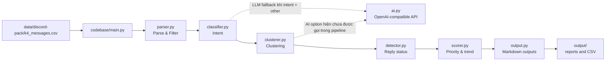

# Guild - Discord Q&A Intelligence Pipeline

Tài liệu này mô tả code tree, luồng xử lý, quan hệ giữa các module, tính năng và cách chạy project bằng `.venv`.

## 1. Tổng quan

Đây là pipeline Track B2 giúp TA/labcoach rà soát câu hỏi trong Discord cuối ngày. Pipeline nhận file CSV tin nhắn, lọc câu hỏi của người dùng, phân loại intent, nhóm các câu hỏi tương tự, phát hiện trạng thái trả lời, tính điểm ưu tiên và sinh các báo cáo:

- Leaderboard câu hỏi cần xử lý trước.
- Danh sách câu hỏi chưa được trả lời quá số giờ quy định.
- Xu hướng chủ đề đang nóng.

AI được dùng qua API tương thích OpenAI, cấu hình bằng biến môi trường. Khi chưa có API key, code có đường fallback rule-based/mock để demo.

## 2. Code tree

```text
K4-3B-E403-4ACE/
├── demo.py                    # Demo end-to-end và chạy evaluation
├── discord_bot.py             # Discord bot với slash commands
├── requirements.txt            # Dependency Python
├── README.md                   # Mô tả ngắn và kiến trúc dự án
├── canvas.md                   # Canvas CP1
├── plan.md                     # Kế hoạch CP3/CP4 của nhóm
├── guild.md                    # Tài liệu này
├── flowchart.html              # Flowchart tương tác bằng Canvas
├── flowchart.jpg               # Ảnh flowchart
├── ui-demo/                    # Prototype frontend React/Vite
│   ├── src/
│   │   ├── App.jsx             # Dashboard Discord và các tương tác demo
│   │   └── main.jsx            # React entry point
│   ├── index.html
│   ├── package.json            # Script dev/build/preview
│   ├── package-lock.json
│   ├── vite.config.js
│   ├── tailwind.config.js
│   └── node_modules/           # Dependency đã cài cục bộ
├── codebase/
│   ├── main.py                 # Entry point pipeline chính
│   ├── ai.py                   # API client, prompt, log LLM
│   ├── parser.py               # Lọc và làm sạch tin nhắn
│   ├── classifier.py           # Phân loại intent bằng rule, LLM fallback
│   ├── clusterer.py            # Nhóm câu hỏi tương tự
│   ├── detector.py             # Phát hiện đã/chưa có reply
│   ├── scorer.py               # Tính điểm ưu tiên và trend
│   └── output.py               # Render Markdown/Discord embed
├── eval/
│   ├── golden_set.md           # Golden set 25 case và quality bar
│   ├── run_eval.py             # Chạy evaluation intent/status
│   └── eval_results.json       # Kết quả evaluation gần nhất
├── data/discord-pack/
│   ├── k4_messages.csv         # Input tin nhắn Discord
│   └── k4_daily_reports.md     # Baseline bản tin bot
├── evidence/
│   └── mining_results.md       # Evidence mining
├── logs/
│   └── ai_calls.jsonl          # Log request/response LLM
└── output/
    ├── leaderboard.md          # Báo cáo xếp hạng
    ├── unanswered.md           # Báo cáo câu hỏi tồn
    ├── trend.md                # Báo cáo xu hướng
    ├── stats.json              # Thống kê pipeline
    └── questions_analyzed.csv  # Dữ liệu sau phân tích
```

## 3. Kiến trúc và quan hệ module



### Luồng dữ liệu thực tế

1. `main.py` đọc CSV và chuyển `created_at_vn` sang datetime.
2. `parser.filter_questions()` bỏ tin bot, chỉ giữ tin có dấu `?` và dài ít nhất 10 ký tự; sau đó làm sạch mention/link/email.
3. `classifier.classify_intent()` dò keyword theo thứ tự ưu tiên. Nếu `use_ai=True` và còn intent `other`, module này gọi LLM fallback trong `ai.py`.
4. `clusterer.cluster_questions()` tạo cluster bằng cùng intent và keyword overlap. Hàm `find_similar()` hiện chưa triển khai embedding/semantic LLM; nhánh `use_ai` chỉ chứa `pass` rồi tiếp tục dùng rule-based.
5. `detector.detect_response_status()` tìm tin có `reply_to == msg_id`. Có reply từ bot thì `partial`, reply khác thì `answered`, không có reply thì `unanswered`.
6. `scorer.calculate_priority_scores()` tính điểm theo công thức:

   `cluster_size × urgency_weight × freshness_score × unanswered_bonus`
7. `output.py` render leaderboard, unanswered list và trend; `main.py` ghi các file vào `output/`.

## 4. Các entry point

### `ui-demo/` - Frontend prototype (đã hoàn thành)

Đây là prototype giao diện cho TA, xây bằng React 18 + Vite + Tailwind CSS + `lucide-react`. Prototype hiện đọc dữ liệu snapshot từ:

- `../output/stats.json` - KPI tổng quan.
- `../output/questions_analyzed.csv` - danh sách câu hỏi đã phân tích.

Các chức năng demo chính:

- Dashboard KPI: tổng tin nhắn, tổng câu hỏi, answered, unanswered và clusters.
- Leaderboard có tìm kiếm, lọc theo intent/status và sắp xếp theo priority, newest hoặc repeated.
- Danh sách câu hỏi chưa trả lời và trạng thái quá 4 giờ.
- Trend theo intent/chủ đề.
- Mô phỏng Discord bot với `/leaderboard`, `/unanswered`, `/trend`, `/dashboard` và `/help`.
- Nút chạy phân tích có trạng thái loading để phục vụ demo flow.
- Xem chi tiết câu hỏi, copy mã tin nhắn và mở link Discord placeholder.

#### Cách mở prototype trên Windows PowerShell

Mở terminal tại root project rồi chạy:

```powershell
cd ui-demo
npm run dev
```

Sau khi terminal hiện địa chỉ Vite, mở trình duyệt tại:

```text
http://localhost:5173
```

Vì `vite.config.js` đã đặt `host: 0.0.0.0`, có thể mở bằng địa chỉ mạng nội bộ mà Vite in ra nếu muốn trình diễn trên thiết bị khác.

Dừng server bằng `Ctrl+C`.

#### Nếu máy chưa có Node.js hoặc npm

Kiểm tra:

```powershell
node --version
npm --version
```

Nếu một trong hai lệnh không tồn tại, cài Node.js bản LTS rồi mở lại VS Code/terminal. Sau đó từ thư mục `ui-demo` chạy:

```powershell
npm install
npm run dev
```

`node_modules` hiện đã có trong workspace, nhưng vẫn cần npm có trong PATH để chạy script.

#### Các lệnh frontend khác

```powershell
cd ui-demo
npm run build
npm run preview
```

- `npm run build`: tạo bản production trong `ui-demo/dist/`.
- `npm run preview`: mở bản build production tại `http://localhost:4173`.

Prototype này là UI demo dùng dữ liệu snapshot; nút chạy phân tích hiện mô phỏng loading, chưa gọi trực tiếp Python pipeline hoặc LLM runtime.

### `codebase/main.py`

Entry point pipeline chính. Chạy không có argument sẽ xử lý toàn bộ CSV với `use_ai=True`. Có ba command mock:

```text
/leaderboard
/unanswered
/trend
```

Lưu ý: phải chạy từ thư mục root project vì `DATA_PATH` là đường dẫn tương đối `data/discord-pack/k4_messages.csv`.

### `demo.py`

Entry point phù hợp để quay demo CP3. Nó chạy pipeline nhanh bằng rule-based (`use_ai=False`), in top 5, chạy evaluator và hiển thị log AI nếu file log tồn tại.

Lưu ý: demo này không tự chứng minh một LLM call thành công vì bước phân loại được gọi với `use_ai=False`. Muốn kiểm tra AI thật, cần chạy luồng có `use_ai=True`, có API key hợp lệ và kiểm tra `logs/ai_calls.jsonl` có entry `status: success`.

### `eval/run_eval.py`

Chạy 25 case intent và kiểm tra status trên dữ liệu CSV thật. Quality bar đang ghi trong code/file kết quả:

- Intent accuracy >= 80%.
- Status detection >= 85%.
- Không hallucination trong output.

Evaluator hiện chưa tự động chấm cluster quality và priority ranking dù `golden_set.md` có nêu hai chiều này.

### `discord_bot.py`

Tạo Discord client bằng `discord.py`, nạp dữ liệu một lần khi process khởi động và đăng ký các slash command:

- `/leaderboard`: top câu hỏi theo priority score.
- `/unanswered hours: int`: câu hỏi chưa trả lời quá số giờ, mặc định 4.
- `/trend`: chủ đề có tổng điểm cao.
- `/stats`: tổng câu hỏi, answered, partial, unanswered và trạng thái AI.

Bot cần `DISCORD_BOT_TOKEN`. Đây là bot đọc dữ liệu CSV hiện tại; code chưa có cơ chế đồng bộ tin nhắn Discord mới vào pipeline.

## 5. Cấu hình môi trường

Tạo file `.env` ở root project. Không commit file này.

```dotenv
OPENAI_API_KEY=your_api_key
OPENAI_BASE_URL=https://your-openai-compatible-endpoint/v1
MODEL=qwen3.7-flash

# Chỉ cần nếu chạy Discord bot
DISCORD_BOT_TOKEN=your_discord_bot_token
```

`OPENAI_BASE_URL` mặc định trong `codebase/ai.py` trỏ tới endpoint Qwen đã cấu hình sẵn trong code. Nên đặt rõ giá trị trong `.env` khi đổi endpoint/model.

## 6. Tạo và kích hoạt `.venv`

### PowerShell trên Windows

Từ root project:

```powershell
py -3 -m venv .venv
.\.venv\Scripts\Activate.ps1
python -m pip install --upgrade pip
python -m pip install -r requirements.txt
```

Nếu PowerShell chặn script activation trong phiên hiện tại:

```powershell
Set-ExecutionPolicy -Scope Process Bypass
.\.venv\Scripts\Activate.ps1
```

Kiểm tra interpreter:

```powershell
python --version
Get-Command python
```

Khi kích hoạt đúng, `Get-Command python` phải trỏ vào `.venv\Scripts\python.exe`.

### Command Prompt

```bat
py -3 -m venv .venv
.venv\Scripts\activate.bat
python -m pip install --upgrade pip
python -m pip install -r requirements.txt
```

### Bash / Git Bash

```bash
py -3 -m venv .venv
source .venv/Scripts/activate
python -m pip install --upgrade pip
python -m pip install -r requirements.txt
```

Thoát môi trường khi xong:

```text
deactivate
```

## 7. Cách chạy và kiểm tra

### Compile kiểm tra cú pháp

```powershell
python -m compileall -q codebase eval demo.py discord_bot.py
```

### Chạy pipeline đầy đủ

```powershell
python codebase\main.py
```

Không chạy theo hướng dẫn cũ `cd codebase; python main.py`, vì khi đó đường dẫn tương đối tới `data/` và `output/` sẽ bị tính từ `codebase/`.

### Chạy các command demo từ pipeline

```powershell
python codebase\main.py /leaderboard
python codebase\main.py /unanswered
python codebase\main.py /trend
```

### Chạy evaluator

```powershell
python eval\run_eval.py
```

Kết quả được ghi vào `eval/eval_results.json`. Lệnh này chạy trên dữ liệu CSV thật được lưu trong repo, nhưng không gọi LLM cho các case intent.

### Chạy demo CP3

```powershell
python demo.py
```

### Chạy Discord bot

`discord_bot.py` hiện import các module trong `codebase/` như module top-level. Vì vậy, từ PowerShell root cần thêm `codebase` vào `PYTHONPATH` trước khi chạy:

```powershell
$env:PYTHONPATH = "$PWD\codebase"
python discord_bot.py
```

Hoặc chạy một dòng trong Git Bash:

```bash
PYTHONPATH="$PWD/codebase" python discord_bot.py
```

Bot cần token hợp lệ và Discord application đã bật Message Content Intent, nếu code cần đọc message content trực tiếp.

## 8. Bảng tính năng và trạng thái triển khai

| Tính năng                  | Module                          | Trạng thái hiện tại                                      |
| ---------------------------- | ------------------------------- | ------------------------------------------------------------ |
| Frontend Discord dashboard   | `ui-demo/src/App.jsx`         | Prototype UI đã hoàn thành, dùng dữ liệu snapshot     |
| Đọc CSV Discord            | `main.py`, `discord_bot.py` | Đã có                                                     |
| Lọc câu hỏi người dùng | `parser.py`                   | Rule-based: không bot, có`?`, >= 10 ký tự              |
| Phân loại intent           | `classifier.py`, `ai.py`    | Keyword chính; LLM fallback cho`other`                    |
| Nhóm câu hỏi tương tự  | `clusterer.py`                | Keyword overlap; semantic embedding chưa có                |
| Phát hiện reply            | `detector.py`                 | Dựa trên`reply_to`; `partial` nếu reply đầu là bot |
| Xếp hạng ưu tiên         | `scorer.py`                   | Công thức frequency/urgency/freshness/status               |
| Báo cáo Markdown           | `output.py`                   | Leaderboard, unanswered, trend                               |
| Discord slash commands       | `discord_bot.py`              | Có 4 command, dùng snapshot CSV khi khởi động           |
| Evaluation                   | `eval/run_eval.py`            | 25 intent case và status detection                          |
| Log AI                       | `ai.py`                       | JSONL tại`logs/ai_calls.jsonl`                            |

## 9. Các điểm cần biết khi phát triển tiếp

- `main.py`, `demo.py` và `discord_bot.py` dùng nhiều đường dẫn tương đối; luôn chạy từ root project.
- `discord_bot.py` cần `PYTHONPATH=codebase` hoặc cần được refactor sang import `codebase.*` nếu muốn chạy trực tiếp ổn định.
- `clusterer.py` ghi chú là semantic similarity nhưng implementation hiện tại chỉ dùng intent và keyword overlap; không nên mô tả đây là embedding clustering.
- `scorer.py` tính freshness dựa trên thời điểm mới nhất trong dataset, không phải thời gian hiện tại. Vì vậy `age_hours > 4` là tuổi tương đối trong snapshot, không hoàn toàn là “đã 4 giờ ngoài đời”.
- `detector.py` chỉ xét reply trực tiếp và reply đầu tiên; chưa kiểm tra reply trong thread khác, nội dung có giải quyết câu hỏi hay người trả lời là TA/Mod.
- `output.py` sinh link mẫu `https://discord.com/msg/<msg_id>`, chưa phải URL Discord thật có guild/channel/message ID.
- `ai.py` tắt SSL certificate verification (`CERT_NONE`). Đây là rủi ro bảo mật và chỉ nên dùng khi endpoint nội bộ bắt buộc; production nên bật xác minh certificate.
- `ui-demo` là frontend prototype độc lập; dữ liệu được import lúc build từ `output/`, nên cần chạy pipeline Python trước nếu muốn cập nhật số liệu hiển thị.
- Frontend chưa gọi trực tiếp backend/API AI; `handleRunAnalysis()` chỉ mô phỏng thời gian loading. Khi tích hợp thật, cần nối nút này với API/service chạy pipeline.
- Dữ liệu Discord là dữ liệu đã ẩn danh nhưng vẫn thuộc phạm vi hackathon. Không commit API key, không đẩy nguyên data pack lên repo public và không suy đoán danh tính người gửi.

## 10. Trạng thái rà soát

- Đã đọc toàn bộ Python source, evaluator, requirements, README và các file cấu hình liên quan.
- `compileall` bằng Python hệ thống đã qua.
- Prototype frontend đã hoàn thành trong `ui-demo/`; lần rà soát hiện tại chưa chạy được `npm run build` vì terminal chưa nhận diện lệnh `npm`.
- Lần rà soát trước chưa chạy được evaluator/demo bằng `.venv` vì repository chưa có thư mục `.venv`; Python hệ thống cũng chưa cài `pandas`.
- Sau khi tạo `.venv` và cài dependency, chạy lại các lệnh ở mục 7 để xác nhận runtim

# Guild - Discord Q&A Intelligence Pipeline

Tài liệu này mô tả code tree, luồng xử lý, quan hệ giữa các module, tính năng và cách chạy project bằng `.venv`.

## 1. Tổng quan

Đây là pipeline Track B2 giúp TA/labcoach rà soát câu hỏi trong Discord cuối ngày. Pipeline nhận file CSV tin nhắn, lọc câu hỏi của người dùng, phân loại intent, nhóm các câu hỏi tương tự, phát hiện trạng thái trả lời, tính điểm ưu tiên và sinh các báo cáo:

- Leaderboard câu hỏi cần xử lý trước.
- Danh sách câu hỏi chưa được trả lời quá số giờ quy định.
- Xu hướng chủ đề đang nóng.

AI được dùng qua API tương thích OpenAI, cấu hình bằng biến môi trường. Khi chưa có API key, code có đường fallback rule-based/mock để demo.

## 2. Code tree

```text
K4-3B-E403-4ACE/
├── demo.py                    # Demo end-to-end và chạy evaluation
├── discord_bot.py             # Discord bot với slash commands
├── requirements.txt            # Dependency Python
├── README.md                   # Mô tả ngắn và kiến trúc dự án
├── canvas.md                   # Canvas CP1
├── plan.md                     # Kế hoạch CP3/CP4 của nhóm
├── guild.md                    # Tài liệu này
├── flowchart.html              # Flowchart tương tác bằng Canvas
├── flowchart.jpg               # Ảnh flowchart
├── codebase/
│   ├── main.py                 # Entry point pipeline chính
│   ├── ai.py                   # API client, prompt, log LLM
│   ├── parser.py               # Lọc và làm sạch tin nhắn
│   ├── classifier.py           # Phân loại intent bằng rule, LLM fallback
│   ├── clusterer.py            # Nhóm câu hỏi tương tự
│   ├── detector.py             # Phát hiện đã/chưa có reply
│   ├── scorer.py               # Tính điểm ưu tiên và trend
│   └── output.py               # Render Markdown/Discord embed
├── eval/
│   ├── golden_set.md           # Golden set 25 case và quality bar
│   ├── run_eval.py             # Chạy evaluation intent/status
│   └── eval_results.json       # Kết quả evaluation gần nhất
├── data/discord-pack/
│   ├── k4_messages.csv         # Input tin nhắn Discord
│   └── k4_daily_reports.md     # Baseline bản tin bot
├── evidence/
│   └── mining_results.md       # Evidence mining
├── logs/
│   └── ai_calls.jsonl          # Log request/response LLM
└── output/
    ├── leaderboard.md          # Báo cáo xếp hạng
    ├── unanswered.md           # Báo cáo câu hỏi tồn
    ├── trend.md                # Báo cáo xu hướng
    ├── stats.json              # Thống kê pipeline
    └── questions_analyzed.csv  # Dữ liệu sau phân tích
```

## 3. Kiến trúc và quan hệ module


### Luồng dữ liệu thực tế

1. `main.py` đọc CSV và chuyển `created_at_vn` sang datetime.
2. `parser.filter_questions()` bỏ tin bot, chỉ giữ tin có dấu `?` và dài ít nhất 10 ký tự; sau đó làm sạch mention/link/email.
3. `classifier.classify_intent()` dò keyword theo thứ tự ưu tiên. Nếu `use_ai=True` và còn intent `other`, module này gọi LLM fallback trong `ai.py`.
4. `clusterer.cluster_questions()` tạo cluster bằng cùng intent và keyword overlap. Hàm `find_similar()` hiện chưa triển khai embedding/semantic LLM; nhánh `use_ai` chỉ chứa `pass` rồi tiếp tục dùng rule-based.
5. `detector.detect_response_status()` tìm tin có `reply_to == msg_id`. Có reply từ bot thì `partial`, reply khác thì `answered`, không có reply thì `unanswered`.
6. `scorer.calculate_priority_scores()` tính điểm theo công thức:

   `cluster_size × urgency_weight × freshness_score × unanswered_bonus`
7. `output.py` render leaderboard, unanswered list và trend; `main.py` ghi các file vào `output/`.

## 4. Các entry point

### `codebase/main.py`

Entry point pipeline chính. Chạy không có argument sẽ xử lý toàn bộ CSV với `use_ai=True`. Có ba command mock:

```text
/leaderboard
/unanswered
/trend
```

Lưu ý: phải chạy từ thư mục root project vì `DATA_PATH` là đường dẫn tương đối `data/discord-pack/k4_messages.csv`.

### `demo.py`

Entry point phù hợp để quay demo CP3. Nó chạy pipeline nhanh bằng rule-based (`use_ai=False`), in top 5, chạy evaluator và hiển thị log AI nếu file log tồn tại.

Lưu ý: demo này không tự chứng minh một LLM call thành công vì bước phân loại được gọi với `use_ai=False`. Muốn kiểm tra AI thật, cần chạy luồng có `use_ai=True`, có API key hợp lệ và kiểm tra `logs/ai_calls.jsonl` có entry `status: success`.

### `eval/run_eval.py`

Chạy 25 case intent và kiểm tra status trên dữ liệu CSV thật. Quality bar đang ghi trong code/file kết quả:

- Intent accuracy >= 80%.
- Status detection >= 85%.
- Không hallucination trong output.

Evaluator hiện chưa tự động chấm cluster quality và priority ranking dù `golden_set.md` có nêu hai chiều này.

### `discord_bot.py`

Tạo Discord client bằng `discord.py`, nạp dữ liệu một lần khi process khởi động và đăng ký các slash command:

- `/leaderboard`: top câu hỏi theo priority score.
- `/unanswered hours: int`: câu hỏi chưa trả lời quá số giờ, mặc định 4.
- `/trend`: chủ đề có tổng điểm cao.
- `/stats`: tổng câu hỏi, answered, partial, unanswered và trạng thái AI.

Bot cần `DISCORD_BOT_TOKEN`. Đây là bot đọc dữ liệu CSV hiện tại; code chưa có cơ chế đồng bộ tin nhắn Discord mới vào pipeline.

## 5. Cấu hình môi trường

Tạo file `.env` ở root project. Không commit file này.

```dotenv
OPENAI_API_KEY=your_api_key
OPENAI_BASE_URL=https://your-openai-compatible-endpoint/v1
MODEL=qwen3.7-flash

# Chỉ cần nếu chạy Discord bot
DISCORD_BOT_TOKEN=your_discord_bot_token
```

`OPENAI_BASE_URL` mặc định trong `codebase/ai.py` trỏ tới endpoint Qwen đã cấu hình sẵn trong code. Nên đặt rõ giá trị trong `.env` khi đổi endpoint/model.

## 6. Tạo và kích hoạt `.venv`

### PowerShell trên Windows

Từ root project:

```powershell
py -3 -m venv .venv
.\.venv\Scripts\Activate.ps1
python -m pip install --upgrade pip
python -m pip install -r requirements.txt
```

Nếu PowerShell chặn script activation trong phiên hiện tại:

```powershell
Set-ExecutionPolicy -Scope Process Bypass
.\.venv\Scripts\Activate.ps1
```

Kiểm tra interpreter:

```powershell
python --version
Get-Command python
```

Khi kích hoạt đúng, `Get-Command python` phải trỏ vào `.venv\Scripts\python.exe`.

### Command Prompt

```bat
py -3 -m venv .venv
.venv\Scripts\activate.bat
python -m pip install --upgrade pip
python -m pip install -r requirements.txt
```

### Bash / Git Bash

```bash
py -3 -m venv .venv
source .venv/Scripts/activate
python -m pip install --upgrade pip
python -m pip install -r requirements.txt
```

Thoát môi trường khi xong:

```text
deactivate
```

## 7. Cách chạy và kiểm tra

### Compile kiểm tra cú pháp

```powershell
python -m compileall -q codebase eval demo.py discord_bot.py
```

### Chạy pipeline đầy đủ

```powershell
python codebase\main.py
```

Không chạy theo hướng dẫn cũ `cd codebase; python main.py`, vì khi đó đường dẫn tương đối tới `data/` và `output/` sẽ bị tính từ `codebase/`.

### Chạy các command demo từ pipeline

```powershell
python codebase\main.py /leaderboard
python codebase\main.py /unanswered
python codebase\main.py /trend
```

### Chạy evaluator

```powershell
python eval\run_eval.py
```

Kết quả được ghi vào `eval/eval_results.json`. Lệnh này chạy trên dữ liệu CSV thật được lưu trong repo, nhưng không gọi LLM cho các case intent.

### Chạy demo CP3

```powershell
python demo.py
```

### Chạy Discord bot

`discord_bot.py` hiện import các module trong `codebase/` như module top-level. Vì vậy, từ PowerShell root cần thêm `codebase` vào `PYTHONPATH` trước khi chạy:

```powershell
$env:PYTHONPATH = "$PWD\codebase"
python discord_bot.py
```

Hoặc chạy một dòng trong Git Bash:

```bash
PYTHONPATH="$PWD/codebase" python discord_bot.py
```

Bot cần token hợp lệ và Discord application đã bật Message Content Intent, nếu code cần đọc message content trực tiếp.

## 8. Bảng tính năng và trạng thái triển khai

| Tính năng                  | Module                          | Trạng thái hiện tại                                      |
| ---------------------------- | ------------------------------- | ------------------------------------------------------------ |
| Đọc CSV Discord            | `main.py`, `discord_bot.py` | Đã có                                                     |
| Lọc câu hỏi người dùng | `parser.py`                   | Rule-based: không bot, có`?`, >= 10 ký tự              |
| Phân loại intent           | `classifier.py`, `ai.py`    | Keyword chính; LLM fallback cho`other`                    |
| Nhóm câu hỏi tương tự  | `clusterer.py`                | Keyword overlap; semantic embedding chưa có                |
| Phát hiện reply            | `detector.py`                 | Dựa trên`reply_to`; `partial` nếu reply đầu là bot |
| Xếp hạng ưu tiên         | `scorer.py`                   | Công thức frequency/urgency/freshness/status               |
| Báo cáo Markdown           | `output.py`                   | Leaderboard, unanswered, trend                               |
| Discord slash commands       | `discord_bot.py`              | Có 4 command, dùng snapshot CSV khi khởi động           |
| Evaluation                   | `eval/run_eval.py`            | 25 intent case và status detection                          |
| Log AI                       | `ai.py`                       | JSONL tại`logs/ai_calls.jsonl`                            |

## 9. Các điểm cần biết khi phát triển tiếp

- `main.py`, `demo.py` và `discord_bot.py` dùng nhiều đường dẫn tương đối; luôn chạy từ root project.
- `discord_bot.py` cần `PYTHONPATH=codebase` hoặc cần được refactor sang import `codebase.*` nếu muốn chạy trực tiếp ổn định.
- `clusterer.py` ghi chú là semantic similarity nhưng implementation hiện tại chỉ dùng intent và keyword overlap; không nên mô tả đây là embedding clustering.
- `scorer.py` tính freshness dựa trên thời điểm mới nhất trong dataset, không phải thời gian hiện tại. Vì vậy `age_hours > 4` là tuổi tương đối trong snapshot, không hoàn toàn là “đã 4 giờ ngoài đời”.
- `detector.py` chỉ xét reply trực tiếp và reply đầu tiên; chưa kiểm tra reply trong thread khác, nội dung có giải quyết câu hỏi hay người trả lời là TA/Mod.
- `output.py` sinh link mẫu `https://discord.com/msg/<msg_id>`, chưa phải URL Discord thật có guild/channel/message ID.
- `ai.py` tắt SSL certificate verification (`CERT_NONE`). Đây là rủi ro bảo mật và chỉ nên dùng khi endpoint nội bộ bắt buộc; production nên bật xác minh certificate.
- Dữ liệu Discord là dữ liệu đã ẩn danh nhưng vẫn thuộc phạm vi hackathon. Không commit API key, không đẩy nguyên data pack lên repo public và không suy đoán danh tính người gửi.

## 10. Trạng thái rà soát

- Đã đọc toàn bộ Python source, evaluator, requirements, README và các file cấu hình liên quan.
- `compileall` bằng Python hệ thống đã qua.
- Lần rà soát này chưa chạy được evaluator/demo bằng `.venv` vì repository chưa có thư mục `.venv`; Python hệ thống cũng chưa cài `pandas`.
- Sau khi tạo `.venv` và cài dependency, chạy lại các lệnh ở mục 7 để xác nhận runtime.
